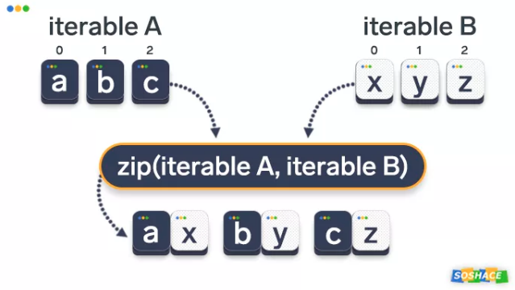
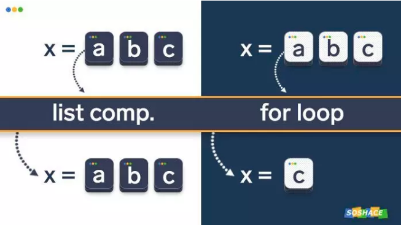

## Python中zip()函数详解  

 

### zip()的作用  
zip()语法：  
>zip(iter1 [,iter2 [...]]) —> zip object

Python的内置help()模块对此的解释：
>返回一个元组迭代器，其中第i个元组包含每个参数序列或可迭代对象中的第i个元素。当最短的可迭代输入耗尽时，迭代器将停止。使用单个可迭代参数，它将返回1元组的迭代器。没有参数，它将返回一个空的迭代器。

#### zip的实际作用:从许多迭代中获取元素，然后…… 放在一起

举例简单演示zip()的功能:
>uppercase = ['A', 'B', 'C']  
lowercase = ['a', 'b', 'c']  
for x, y in zip(uppercase, lowercase):  
&#8194;&#8195;print(x, y)

输出:
>A a  
B b  
C c

但是，不限于两个可迭代对象作为参数传递-我们可以添加任意多个：
>uppercase = ['A', 'B', 'C']  
lowercase = ['a', 'b', 'c']  
numbers = [1, 2, 3]  
for x, y, z in zip(uppercase, lowercase, numbers):  
&#8194;&#8195;print(x, y, z)

输出:
>A a 1  
B b 2  
C c 3

#### zip()函数在Python中的工作方式  

 

如果各个迭代器的元素个数不一致，则zip()函数返回列表长度与最短的对象相同：
>uppercase = ['A', 'B', 'C', 'D', 'E']  
lowercase = ['a', 'b', 'c', 'd']  
numbers = [1, 2, 3]  
for x, y, z in zip(uppercase, lowercase, numbers):  
&#8194;&#8195;print(x, y, z)

输出:  
>A a 1  
B b 2  
C c 3

尽管似乎在调用此函数时会得到一个列表，但实际上它返回一个称为zip object的特殊数据类型，这意味着使用索引将无法浏览，下面我们学习如何将其转换为其他数据类型（例如列表）。  
在此之前，解释一下迭代（Iteration）、迭代器对象（iterable）、迭代器（iterator ）的概念：  
* Iteration:  
是计算机科学的通用术语。它是指对一组元素执行一项操作，一次执行一个元素。一个很好的例子是循环 -它适用于每个单独的项目，直到整个项目集运行完毕为止。  
* Iterable:  
是可以遍历的对象（译者注：在Python中所有东西都是object, 比如说变量，容器，类），iterable是可以产生iterator的object。  
* iterator:  
是表示数据流的对象，它一次返回一个元素的数据。它还会记住其在迭代过程中的位置。本质上，它控制应如何迭代可迭代对象。

### 将zip()对象转换为列表（并使用索引）  
zip()函数返回一个zip对象（类似于map()操作方式）。  
zip对象提供了一些有趣的功能（迭代速度比list更快），但是我们经常需要将其转换为list。为了做到这一点，我们需要调用list()函数：  
>b = ["red", "green", "blue"]  
c = ["leopard", "cheetah", "jaguar"]  
print(list(zip(b, c)))  

输出:  
[('red', 'leopard'), ('green', 'cheetah'), ('blue', 'jaguar')]  

list()函数将zip对象转换为一个元组列表。我们可以使用索引浏览各个元组。出于可读性考虑，我们首先将新列表分配给一个变量：  
>b = ["red", "green", "blue"]  
c = ["leopard", "cheetah", "jaguar"]  
new_list = list(zip(b, c))  
print(new_list[0])  
print(new_list[1])  
print(new_list[2])  

输出:  
>('red', 'leopard')  
('green', 'cheetah')  
('blue', 'jaguar')

### 将zip()对象转换成字典  
另外，该dict()函数可用于将zip对象转换为字典。需要注意的是，只能使用两个zip()参数-前者产生key，后者产生value：  
>b = ["red", "green", "blue"]  
f = ["strawberry", "kiwi", "blueberry"]  
print(dict(zip(b, f)))

输出:  
>{'red': 'strawberry', 'green': 'kiwi', 'blue': 'blueberry'}

### zip解压列表  
在某些情况下，我们需要执行相反的操作——解压迭代器。解压操作涉及将压缩后的元素恢复为其原始状态。为此，我们添加* 运算符到函数调用中。例：  
>a = [1, 2, 3]  
b = [4, 5, 6]  
zipped = zip(a, b)  
list(zipped)  
a2, b2 = zip(* zip(a, b))  
print(a == list(a2) and b == list(b2))  

输出:  
>True  

### zip与列表生成式（for循环潜在问题）  
zip()函数与Python中的for循环一起使用的可视化

 

#### 在应用for循环后注意缺少的元素！  

Python的另一个很棒的功能——列表推导式，可以与zip()函数结合使用。  
>m = ["mind", "mouse", "mini"]  
n = ["norm", "night", "necklace"]  
[print(a, b) for a, b in zip(m, n)]

输出:  
>mind norm  
mouse night  
mini necklace  
[None, None, None]

如果我们想a从列表生成式获取参数并打印出来，我们得到a NameError的报错提示，这是完全正常的，因为a在列表推导之外不是实数：  
>print(a)  
Traceback (most recent call last):  
&#8195;File "<stdin>", line 1, in <module>  
NameError: name 'a' is not defined

但是，如果使用for循环而不是列表生成式，然后打印a，我们会得到一些奇怪的结果。请记住，for循环输出的结果与列表生成式的结果相同。  
>m = ["mind", "mouse", "mini"]  
n = ["norm", "night", "necklace"]  
for m, n in zip(m, n):  
&#8195;print(m, n)  
print(m)

输出:  
>mind norm  
mouse night  
mini necklace  
mini

事实证明，m先前引用的列表变量"mind", "mouse", "mini"被覆盖了！因此，应该牢记列表生成式和for循环的运行方式完全不同。

### 总结  
zip()函数具体功能,应该看文档实例

#### 内容源自公众号"机器学习算法与Python实战"
